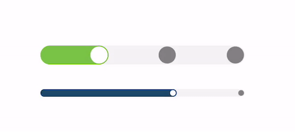
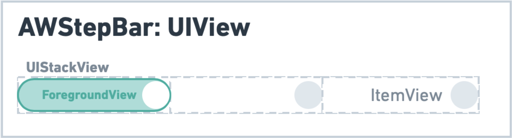

# AWStepBar
 
AWStepBar is a UI Component that allows you to integrate a step progress UI within your app.

## Overview

### Appareance



###  Behind the scenes

As simple as:


## 🔶 Requirements

- iOS 9.0+
- Swift 5.0

## 👨🏻‍💻 Usage

```swift
let stepBar = AWStepBar()
stepBar.numberOfSteps = 3
stepBar.stepBarForegroundColor = .green
stepBar.stepBarBackgroundColor = .lightGray
stepBar.dotColor = .gray
stepBar.dotSelectedColor = .white
stepBar.set(step: 1, animated: false)
```

## Installation

### CocoaPods

```pod 'AWStepBar'```

### Carthage

```github "Aymenworks/AWStepBar"```


## License

AWStepBar is released under the MIT license.
